# ODD Protokoll - Bartender Problem Model
Malte kl. Piening, Mark Hiltenkamp, Christoph Meyer

Angewandte Systemwissenschaften: Regelbasierte Modelle (WS18/19)

Die folgende Modellbeschreibung folgt dem ODD-Schema für ein individuelles, agentenbasiertes Modell. (Grim et al. 2006, 2010)

## 1. Modellzewck
In diesem Modell geht es darum, eine optimale Strategie zum Bewirtschaften der Gäste für Barkeeper zu finden. Dabei ist die Güte einer Strategie die maximale Anzahl der Gäste in Kombination mit der Schwankung der Gästeanzahl, wobei eine hohe Gästedichte mit geringer Schwankung das Perfekte Ergebnis darstellt. Gleichzeitig bleiben Eigenschaften wie Bewegungsgeschwindikeit der Barkeeper oder Verhalten der Gäste konstant.

* * *
## 2. Entitäten, Zustandsvariablen und Skalen
### Agenten
Die Entitäten des Systems werden durch einen Gast und sieben verschiedene Typen von Barkeepern mit jeweils individuellen Strategien dargestellt.
Dabei haben alle Wirte der Übersicht halber Namen erhalten, die eine einfache und eindeutige Identifikation des Typen ermöglichen.
So bestehen die Barkeeper-Entitäten aus den Barkeepern mit den Namen Albus von Pilsner, Bartholomeus von Pilsner, Enolf von Pilsner, Gottfried Metkrug, Hubert Metkrug, Oswald Branntwein und Roland Branntwein.

### Räumliche Einheiten
- Grid (Umgebung)
- Continuous Space (Agenten)

### Umgebung
- Auf Grid
- stellt Lokal mit Tischen und Theke dar
- jede Zelle entweder tisch, Boden oder Theke

### Kollektive
In diesem Modell sind bis auf die Wirttypen `Oswald`und `Gottfried` keine Kollektive vorhanden.

#### Gottfried Metkrug
- einige bringen, andere nehmen auf

#### Oswald Branntwein
Agenten des Wirttyps `Oswald` werden über eine gemeinsame Bestellliste, auf die jede Instanz zugreifen kann und auf der alle bereits bewirteten Gastinstanzen verzeichnet sind, kollektiviert.

### Räumliche und zeitliche Skalierung
- asynchrone updates
- keine Einheit für größe
- sticky borders (wie Wände im Lokal)
- 1 Sekunde pro Tick

* * *
## 3. Prozessübersicht und Terminierung
- allgemeines Agentendiagramm einfügen
- Vorgehen von jedem Agenten kurz beschreiben

### Gast
Da der Fokus dieses Modells auf Prozessstrategien für die Barkeeper liegt, ist ein Agent vom Typ `Gast` sehr Schlicht gehalten und erfüllt ein minimum an Logik um Operationen wie Bestellung und Konsum zu ermöglichen. Die Besonderheit dieses Agententyps ist die zufällige Erscheinung an einem zufälligen Tisch in der Bar, sowie die vorher durch Parameter festgelegte Durstgrenze, die bei Erreichen für das Entfernen der Agenteninstanz des Gastes sorgt.
Im Ausgangszustand befindet sich ein neuer Gast in einem nicht durstigen Zustand, in dem er mit einer festgelegten Wahrscheinlichkeit von 50% trotzdem ein Getränk bestellt. Steigt der Durstwert über die Bestellgrenze, bestellt er immer. Wird dem Agenten ein Getränk geliefert, wird es unabhängig vom Durstwert konsumiert, worauf der Durstwert sinkt. Um das Modell simpel zu halten, wird davon ausgegangen, dass Getränke in einem Zeitschritt rückstandslos konsumiert werden. 

### Bartholomeus von Pilsner
Bartholomeus kann zu jedem Zeitpunkt einen Gast beliefern. So besitzt er ein Feld für den aktuellen Gast und ein Feld für das Getränk, welches der Gast bestellt hat, bzw. welches er mit sich trägt, um es dem entsprechenden Gast zu liefern.
Zudem ist Bartholomeus Zustandsgesteuert und besitzt die drei Zustände `Bestellung aufnehmen`, `Liefern` und `Getränke holen`. Dementsprechend handelt er von seinen Zuständen abhängig unterschiedlich: Nimmt er aktuell eine Bestellung auf, bewegt er sich in Richtung des Gastes, den er zuvor gewählt hatte. Im Zustand `Liefern` bringt er sein aktuelles Getränk zum entsprechenden Gast. Holt Bartholomeus aktuell Getränke, ist er auf dem Weg zum nächsten Barfeld, um die zuvor aufgenommene Bestellung vorzubereiten. Verlässt sein aktueller Gast zu einem beliebigen Zeitpunkt die Bar oder hat er noch keinen Gast gewählt, lässt er seinen aktuellen Bestellungsvorgang verfallen und wählt einen neuen Gast zufällig aus der Menge aller Gäste.

### Enolf von Pilsner
Bei Enolf von Pilsner handelt es sich um eine Weiterentwicklung von Bartholomeus von Pilsner.
Enolf teilt im Gegensatz zu Bartholomeus die Umgebung mit Hilfe eines Quadtrees, in dem je nach Anzahl der gewünschten Partitionen auch Felder verbinden und somit größer als die übrigen Felder werdenkönnen, auf und verteilt die Partitionen auf die Enolf-Instanzen, um keine Überschneidungen der Zustandsbereiche zu erzeugen und durch kurze Wege der Barkeeper eine gleichmäßige Verteilung der Gäste auf den Tischen zu forcieren. Findet eine Enolf.Instanz keinen Gast in seinem Zustandsbereich, so verfährt sie wie Bartholomeus von Pilsner und wählt einen zufälligen Gast.

### Albus von Pilsner
Albus von Pilsner ist eine Weiterentwicklung von Enolf von Pilsner.
So handelt Albus genau wie Enolf und teilt sie Umgebung in Zuständigkeitsbereiche ein, kann jedoch statt nur einer Bestellung mehrere Betellungen aufnehmen.
So werden immer mehrere Gäste gewählt, die sich in einem vorher bestimmten Umkreis befinden, um diese zu beliefern.

### Gottfried Metkrug

### Hubert Metkrug

### Roland Branntwein
Ein Agent vom Typ "Roland" erfüllt die allgemeine Vorgehensweise eines Wirtes, in dem er zunächst die Bestellungsaufnahme (`ORDER`), dann die Getränkezubereitung (`REFILL`) und zuletzt die Bestellungslieferung (`DELIVER`) vornimmt. 
Die Besonderheit dieses Agententyps ist die Anzahl gleichzeitiger Bestellungen, die er in einem Bestellzyklus verarbeiten kann, welche durch einen vorher festgelegten Parameter `storageLimit` begrenzt wird. Nachdem bei einem neuen Bestellzyklus der erste Gast durch das beste Verhältnis `Distanz / Durst` ermittelt wurde, errechnen sich folgende Gäste mit selbigem Verhältnis in einer Reichweiteneinschränkung von 20 Feldern auf dem Grid. Dabei ist die metrische Distanz als Luftlinie und der Durstwert die Zeitschritte, die vergangen sind, seitdem ein Gast bedient wurde, zu sehen. Um zu vermeiden, dass der Wirt durch diese Berechnung bei einem Gast, der keinen Durst (bei Bestellvorgang `abgelehnt`) hat so lange wartet, bis dieser ein Getränk bestellt oder ein Gast mit besserem Verhältnis berechnet wird, wird in diesem Fall der Gastagent einer Blacklist `unthirstyGuests` hinzugefügt, die bei einem neuen Bestellzyklus geleert wird. Gäste auf dieser Blacklist werden bei Bestellvorgang vom Wirt nicht mehr berücksichtigt. Hat die Bestellliste `orderList` das Limit erreicht, oder sind 70 Zeitschritte vergangen, wechselt der Agent in den Zustand `REFILL`, in dem der kürzeste Weg zum nahesten Thekenelement ermittelt und aufgesucht wird. Vor dem hinzufügen der Getränke werden alle Gäste von der Bestellliste entfernt, die bereits gegangen sind, bevor der Agent in den Zustand `DELIVER` wechselt und die Getränke in der Reihenfolge der Bestellungsaufnahme austeilt. Sind keine Gäste in der Bar vorhanden, wechselt der Agent in den Zustand `IDLE`, in dem er pro Zeitschritt in eine zufällige Richtung geht.

### Oswald Branntwein
Ein Agent vom Typ `Oswald` erfüllt alle Vorgehensweisen, die auch eine Agenteninstanz `Roland` erfüllt und stellt eine Erweitung dieses Typen dar.
Die Besonderheit dieses Agententypen ist die `Kollektivität` mehrerer Agenten im Sinne der Zusammenarbeit.
Eine gemeinsame Gästeliste, auf die vor der Auswahl des nächsten Gastes zugegriffen wird, sorgt dafür, dass niemals ein Gast, der bereits bewirtet wird, erneut ausgewählt wird. Ein Gast, der eine Bestellung neu aufgegeben hat, wird dieser Liste `guestManageSet` hinzugefügt. Intern wird diese Variable als HashSet geführt um doppelte Werte automatisch zu vermeiden. Sind weniger Gäste als Agenten dieses Typs existent, so kann eine mehrfache Bedienung eines Gastes dennoch vorkommen.
Ein Beispiel hierfür ist der Ausgangszustand der Bar, in dem meist zunächst weniger Gäste als Wirte anwesend sind.

* * *
## 4. Entwufsmuster
***Questions:*** There are eleven design concepts. Most of these were discussed extensively by Railsback (2001) and Grimm and Railsback (2005; Chapter. 5), and are summarized here via the following questions:

### Grundprinzipien
Es wurde kein vergleichbares Modell in der Vorlesung kennengelernt. Stattdessen handelt es sich um eine Mischung verschiedener in der Vorlesung kennengelernter Modelle. So kommen beispielsweise Ansätze von Räuber-Beute Modellen und Teile des Sugrascape Modells in Kombination mit anderen Modellansätzen zum Einsatz.

### Emergenz 
Das System ist stark emergent. So lässt sich aus der Strategie des gewählten Barkeepers nur schwer bis gar nicht die Güte des Systems bestimmen.

### Adaptivität
- von Agent abhängig

#### Gast
- initial kein durst
- wenn dürsteschwelle erreicht, dann durst
- bei kein durst, bei 50% der Nachfragen durch Wirt bestellen
- bei durst immer bestellen

#### Albus von Pilsner
Initial wählt Albus seine als nächstes zu beliefernden Gäste und wechselt in den Zustand `Bestellung aufnehmen`.
Hat er alle Bestellungen aufgenommen, wechselt er in den `Getränke holen` (im Code auch `FILL_UP`) Zustand, um die aufgenommenen Bestellungen von der Theke zu holen.
Hat er die Theke erreicht, wechselt er in den `Liefern` (in Code `DELIVER`) Zustand, um die Getränke zu den Gästen zu bringen.
Nach Erreichen der Theke wählt er wieder seine Gäste und wechselt in den `Bestellung aufnehmen` (im Code `TAKE_ORDER`) Zustand.
Auch wenn Seine Gäste das Lokal verlassen, wählt er neue Gäste und wechselt in den `Bestellung aufnehmen` Zustand.

#### Bartholomeus von Pilsner
Siehe Albus von Pilsner.

#### Enolf von Pilsner
Siehe Albus von Pilsner.

#### Gottfried Metkrug

#### Hubert Metkrug

#### Oswald Branntwein

#### Roland Branntwein

### Ziele 
Ein Gast verfolgt das Ziel, nicht zu durstig zu werden, dennoch aber auch nicht durchgehend zu trinken.
Gleichzeitig wollen Barkeeper die Gäste beliefern und so die Gäste in der Bar halten.

### Lernen 
Die Agenten dieses Modells beinhalten keinen Lernprozess.

### Vorhersage
- Gäste planen nicht für die Zukunft und treffen keine Vorhersagen
- Wirte entscheiden sich vor Belieferung eines Gastes für einen Gast, bei dem die die bestellung aufnehmen und ihn anschließend beliefern. (sagen "der Gast wird beliefert werden")

### Wahrnehmung 

#### Gast
Der Gast nimmt die Umgebung nicht wahr und agiert nur, wenn seine Durstschwelle überschritten ist, welche das Verlassen der BAr initiiert. Zudem Teilt ein Gast einem Barkeeper sein Wunschgetränk mit, wenn der Barkeeper nach dem Getränk fragt. Außerdem handelt der Gast bei Lieferung seines Getränks, welche jedoch genau wie die Bestellungsaufnahme durch den Barkeeper eingeleitet wird.

#### Wirt
Wirte (auch Barkeeper) sehen die gesamte Bar und alle Gäste.
So haben die Barkeeper nicht die Möglichkeit, sich über Tische zu bewegen und Interagieren nur mit Gästen in ihrer unmittelbaren Umgebung. Diese Interaktion findet entweder im Kontext der Bestellungsaufnahme oder der Getränkeliferung statt.
Zudem bereiten Wirte bei Erreichen der Bar ihre Bestellungen vor, interagieren dabei jedoch nicht mit der Bar, oder anderen Barkeepern. 

### Interaktion 
- Wirte fragen Gäste in unmittelbarer Umgebung nach Wünschen / Bestellung
- Gäste Antworten vom Zustand abhängig mit Wunschgetränk

- Wirte, die Getränke mit sich tragen, beingen Gästen in unmittelbarer Umgebung diese Getränke
- Gast trinkt Getränk auf Ex

### Stochastik 
- Erstellung der Tische in Umgebung (nicht theke) ist zufällig (hat aber feste Entstehungswahrscheinlichkeit eines Tisches)
- Ankommen von Gästen in der Bar ist zufällig
- einige Wirte wählen zu bedienenden Gast zufällig
- Bestellungsaufnahmen von undurstigen Gästen ist zufällig

### Beobachtung 
Um das System zu beobachten, wird die Gäste- und Barkeeperzahl über alle Zeitschritte mitgeschrieben.
Dies wird sowohl in einem Graphen in Repast Simphony, als auch bei Batch runs eingesetzt.
Die Ergebnisse der Batch runs werden mit Hilfe des Tabellenkaluationsprogramms Excel ausgewertet, um Gästeanzahlen und Standardabweichung der Gästeanzahlen zu bestimmen.

* * *
## 5. Initialisierung
- Erstellungsdichte der Tische vor beginn der Simulation
- Anzahl der Wirte je nach Wirttyp
- Erscheinungswahrscheinlichkeit für Gäste
- Umgebungsgröße

* * *
## 6. Eingabedaten
Es existieren keine Eingabedaten externer Quellen.

* * *
## 7. Submodelle
Submodelle sind nicht vorhanden und würden in diesem Umfeld den Rahmen sprengen.

## 8. Ergebnisse
Hier werden unsere Ergebnisse des Modells knapp ausgewertet.
Um dies zu erreichen, wird zuerst zu jedem Barkeeper-Typ die durchschnittliche Gästeanzahl und die Standardabweichung der Gästezahlen nach 3000 Zeitschritten, also nach Einpendeln der Gästeanzahl, in Abhöngigkeit von der Barkeeperzahl aufgezeigt und anschließend die durchschnittliche Gästeanzahl in Abhängigkeit von der Barkeeperzahl aller Barkeeper-Typen verglichen. Allen Diegrammen wurden Trendlinien eingezeichnet, um eine Darstellung zu vereinfachen.

### Roland Branntwein
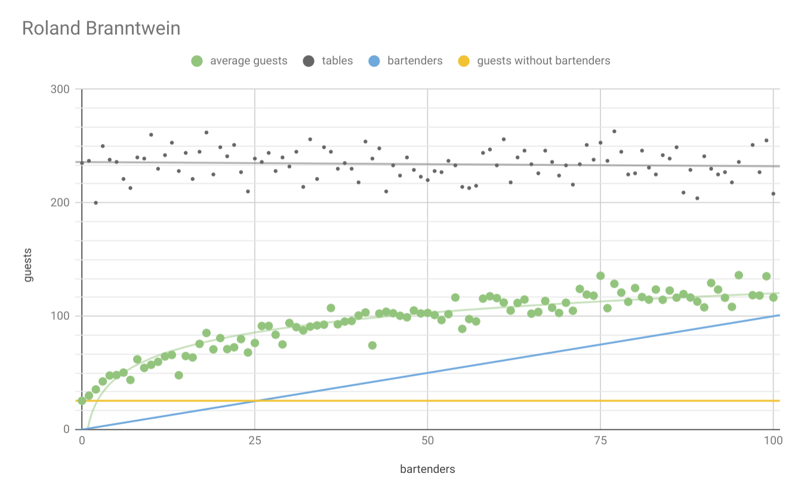
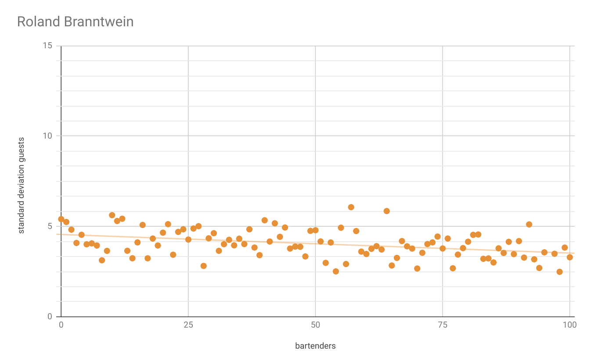

Die mittlere Gästezahl nach 3000 Schritten wächst bei Roland Branntwein in Abhängigkeit von der Barkeeperzahl beschränkt gegen etwa die Hälfte der maximalen Gastkapazität. Gleichzeitig nimmt die Standardabweichung mit zunehmender Barkeeperzahl ab uns hält sich dann etwa in einem Bereich von 4 auf.

### Oswald Branntwein
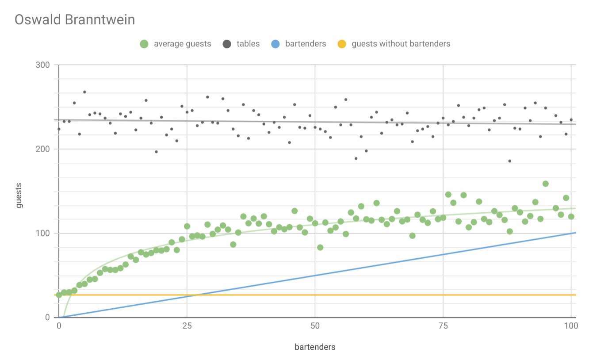
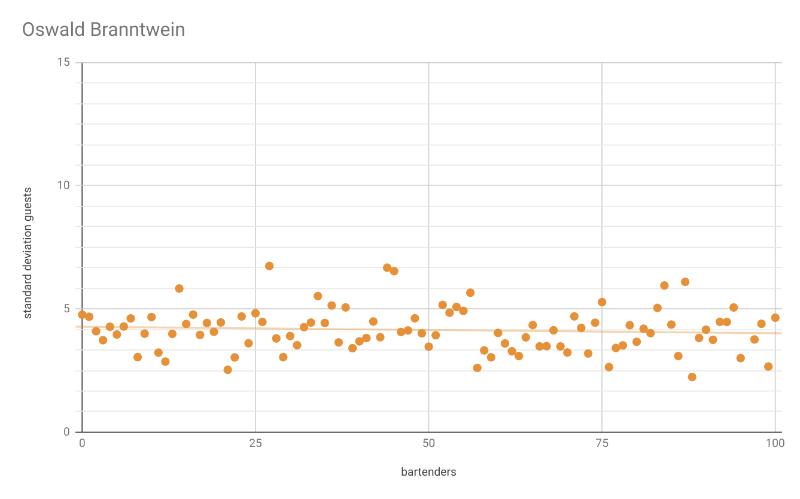

Die mittlere Gästezahl von Oswald wächst ähnlich zu der von Roland Branntwein, hat jedoch einen höheren Grenzwert. Gleichzeitig bleibt die Standardabweichung konstant.

### Hubert Metkrug
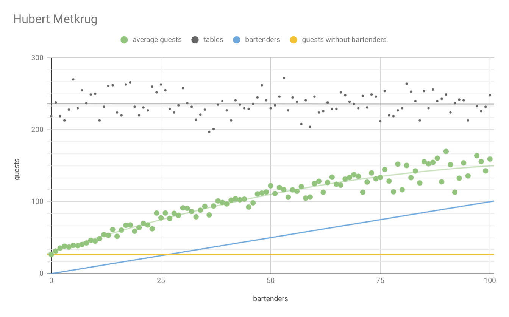
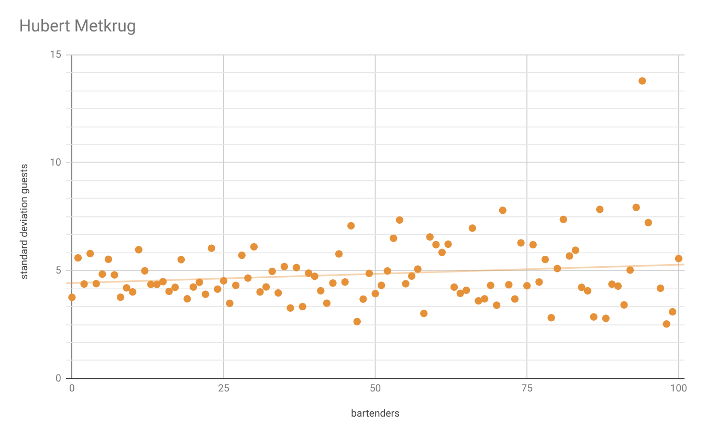

Genau wie Oswald und Roland, weist Hubert Metkrug ein scheinbar begrenztes Wachstum auf. Dabei ist die Effizienz bei höherer Barkeeperzahl jedoch höher als bei Roland und Oswald. Gleichzeitig ist die Standardabweichung jedoch größer als die von Roland uns Oswald, was auf eine instabilere Gastverteilung hinweist.

### Gottfried Metkrug
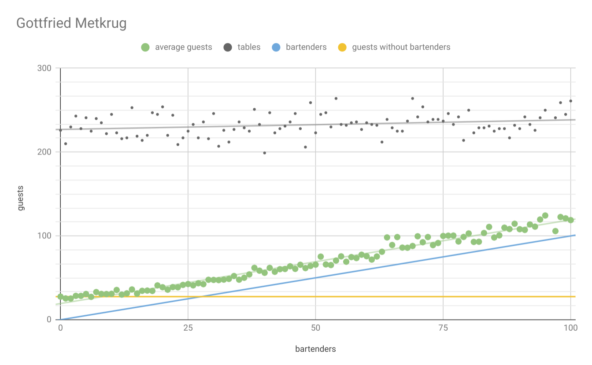
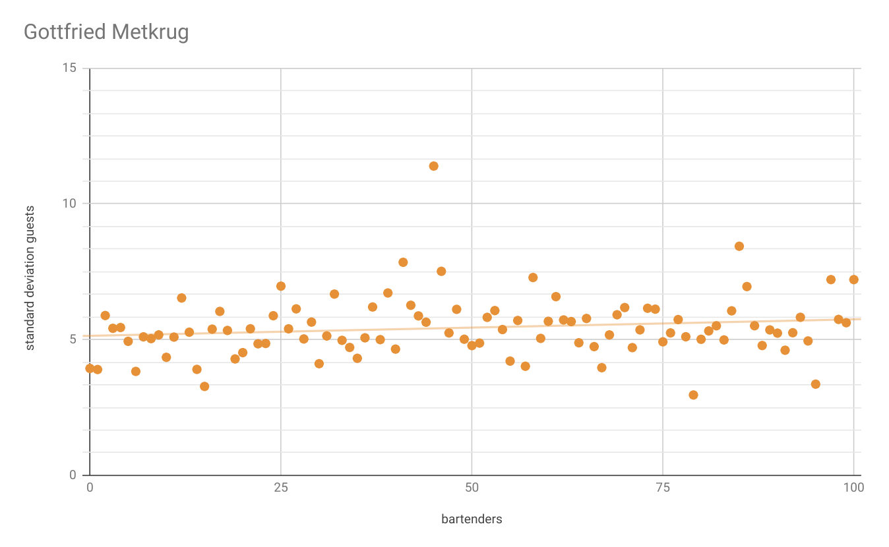

Rottfried Metkrug scheint eine lineare Skalierung mit zunehmender Barkeeperzahl aufzuweisen. Dabei ist die Effizienz die bisher schlechteste. Zudem zeigt Gottfried ähnlich wie Hubert eine starke Schwankung der Gstanzahl.

### Bartholomeus von Pilsner
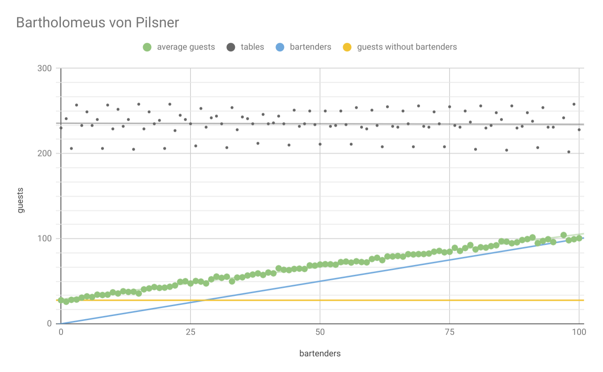
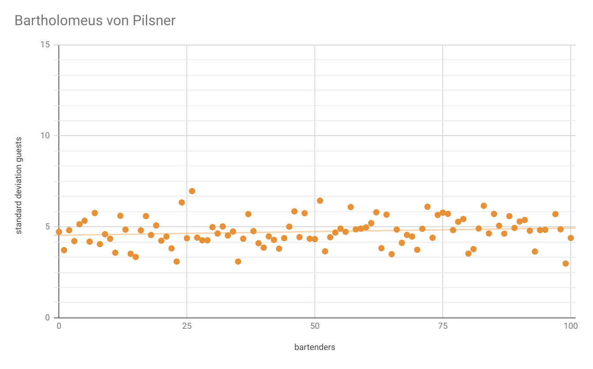

Bartholomeus von Pilsner zeigt eine ähnliche Skalierung wie Gorrfried Metkrug und gehört ebenfalls zu den in dem Bessbereich ineffizientesten Barkeepern. Dabei sind die Ergebnisse der Gastanzahl jedoch konsistender, sprich die Ergebnisse der verschiedenen Durchläufe schwanken nicht so stark und befinden sich strikt nah an der Trendlinie. Dennoch schwankt die Gästeanzahl innerhalb eines Durchlaufs ähnlch zu Gottfried Metkrug mit am stärksten.

### Enolf von Pilsner
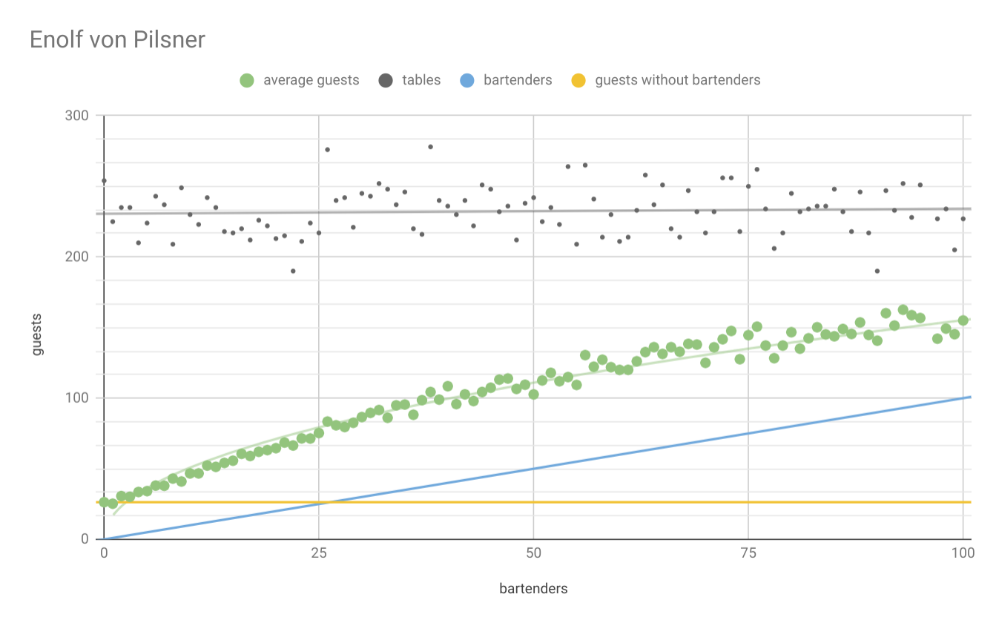
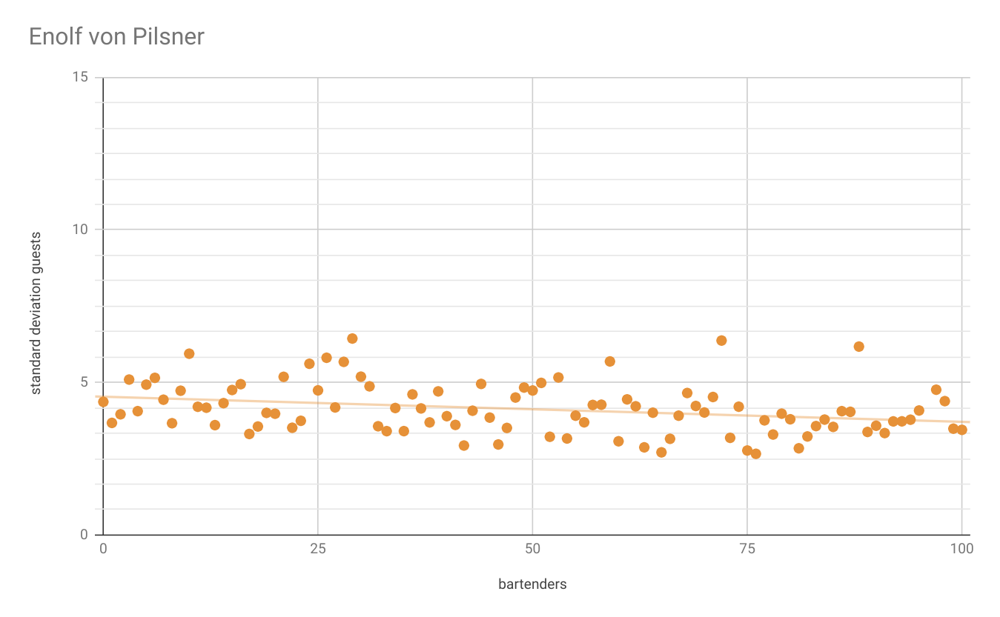

Enolf von Pilsner stellt eine starke Verbesserzng zu Bartholomeus von Pilsner dar.
So steigt die Effizienz auf ein ähnliches Niveau wie Hubert Metkrug und ist bei hohen Barkeeperzahlen etwas Leistungsfähiger als Hubert. Ähnlich wie Roland nimmt die Schwankung mit zunehmender Barkeeperzahl ab und hält sich in einem mit Roland vergleichbaren Bereich auf.

### Albus von Pilsner
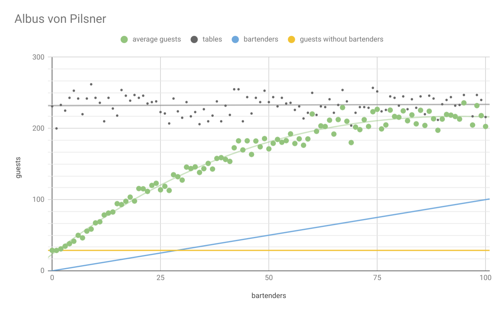

Albus zeichnet sich wie die meisten anderen Barkeeper durch ein begrenztes Wachswum aus.
Dabei befindes sich der Grenszwert jedoch nah an der maximalen Gästeanzahl und zeichnet sich somit durch seine hohe Effizienz aus.
Die Standardabweichung der Gästeanzahl nimmer zeitgleich am stärksten aller Modelle ab und endet am ende des Messbereichts bei einem tiefstwert von etwa 3.

### Kombiniert
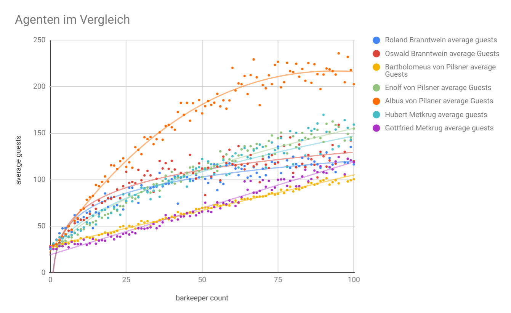

Allgemein ist zu erkennen, dass die Stategie des Albus von Pilsner eine herausragende Leistungsfähigkeit zeigt und somit mit Abstand die größte Gastzahl bietet.
Zudem Skaliert die Strategie von Albus von Pilsner besser alls alle andere Strategien mit zunehmender Barkeeperzahl und läuft dabei gegen die maximal mögliche Gastanzahl.
Denoch fällt auf, dass andere Strategien, wie die von Gottfried Metkrug scheinbar linear skalieren. Dabei stellt sich die Frage, ob dies bei weiter zunehmender Barkeeperzahl weiterhin der Fall sein wird und irgendwann die die maximale Gastanzahl erreicht wird. Dennoch ist die Effizenz auch dieser Strategien ab einer Barkeeperzahl von etwa zehn nicht annähernd so gut, wie die des Albus von Pilsner.

Demnach stellt sich die Strategie von Albus von Pilsner als die beste gefundene heraus.