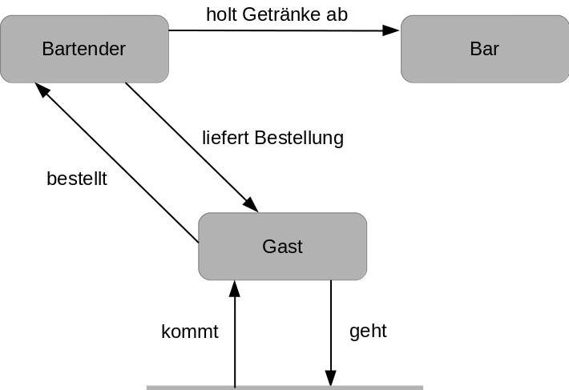
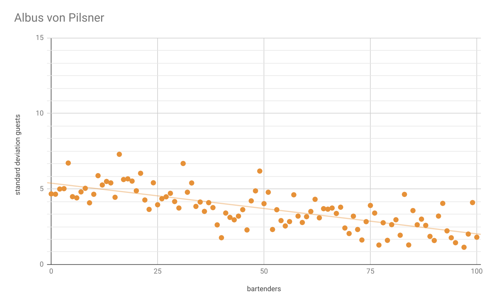

# ODD Protokoll - Bartender Problem Model
Malte kl. Piening, Mark Hiltenkamp, Christoph Meyer

Angewandte Systemwissenschaften: Regelbasierte Modelle (WS18/19)

Die folgende Modellbeschreibung folgt dem ODD-Schema für ein individuelles, agentenbasiertes Modell. (Grim et al. 2006, 2010)

## 1. Modellzweck
In diesem Modell geht es darum, eine optimale Strategie zum Bewirtschaften der Gäste für Barkeeper zu finden. Dabei ist die Güte einer Strategie die maximale Anzahl der Gäste in Kombination mit der Schwankung der Gästeanzahl, wobei eine hohe Gästedichte mit geringer Schwankung das Perfekte Ergebnis darstellt. Gleichzeitig bleiben Eigenschaften wie Bewegungsgeschwindikeit der Barkeeper oder Verhalten der Gäste konstant.

* * *
## 2. Entitäten, Zustandsvariablen und Skalen
### Agenten
Die Entitäten des Systems werden durch einen Gast und sieben verschiedene Typen von Barkeepern mit jeweils individuellen Strategien dargestellt.
Dabei haben alle Wirte der Übersicht halber Namen erhalten, die eine einfache und eindeutige Identifikation des Typen ermöglichen.
So bestehen die Barkeeper-Entitäten aus den Barkeepern mit den Namen Albus von Pilsner, Bartholomeus von Pilsner, Enolf von Pilsner, Gottfried Metkrug, Hubert Metkrug, Oswald Branntwein und Roland Branntwein.

### Räumliche Einheiten und zeitliche Skalierung
Das sich die Modelldynamik ähnlich wie die eines Räuber-Beute Modells verhält, wird das Grid zur Darstellung der Bar, sowie der festen Barelemente zur Interaktion der Agenten genutzt, sowie ein Continuous Space, auf dem die Agenten sich bewegen.
Die Größe des Grids ist durch Höhen- und Breitenparameter ganzzahlig vor Beginn des Simulationslaufes festlegbar. Für die Größe eines Feldes ist keine feste Einheit gegeben. Das Modell verwendet Sticky-Borders.
Ein zeitlicher Maßstab ist asynchron durch Ticks gegeben, bei denen ein Tick als eine vergangene Sekunde gerechnet wird. 

### Umgebung
Die Umgebung auf dem Grid stellt ein Lokal mit Tischen und Theke dar, wobei jedes Feld als Tisch, Boden oder Theke gesetzt ist. Mit dem angegebenen Parameter für die Tischdichte wird bei Initialisierung der Bar die Wahrscheinlichkeit festgelegt, bei der eine Bar-Zelle (ausgenommen Theke) ein Tisch-Element wird. Zellen, die Tische darstellen, können von Gästen besetzt, jedoch nicht von Wirt-Agenten begangen werden.

### Kollektive
In diesem Modell sind bis auf die Wirttypen `Oswald`und `Gottfried` keine Kollektive vorhanden.

#### Gottfried Metkrug
Bei dem Wirttyp `Gottfried Metkrug` wird die Gesamtheit der Wirte in zwei Gruppen aufgeteilt, wobei die Erste nur Bestellungen aufnimmt und die Zweite diese bearbeitet. Der prozentuale Anteil der jeweiligen Gruppen wird dabei bei Erzeugung der Wirte spezifiziert.

#### Oswald Branntwein
Agenten des Wirttyps `Oswald` werden über eine gemeinsame Bestellliste, auf die jede Instanz zugreifen kann und auf der alle bereits bewirteten Gastinstanzen verzeichnet sind, kollektiviert.

* * *
## 3. Prozessübersicht und Terminierung

### Gast
Da der Fokus dieses Modells auf Prozessstrategien für die Barkeeper liegt, ist ein Agent vom Typ `Gast` sehr schlicht gehalten und erfüllt ein Minimum an Logik um Operationen wie `Bestellung` und `Konsum` zu ermöglichen. Die Besonderheit dieses Agententyps ist die (parametrisiert) zufällige Erscheinung an einem zufälligen Tisch in der Bar, sowie die vorher ebenfalls durch Parameter festgelegte Durstgrenze, die bei Erreichen für das Entfernen der Agenteninstanz des Gastes vom Grid sorgt.
Im Ausgangszustand befindet sich ein neuer Gast in einem nicht durstigen Zustand, in dem er mit einer festgelegten Wahrscheinlichkeit von 50% trotzdem ein Getränk bestellt. Steigt der Durstwert über die Bestellgrenze, bestellt er immer. Wird dem Agenten ein Getränk geliefert, wird es unabhängig vom Durstwert konsumiert, worauf der Durstwert sinkt. Um das Modell simpel zu halten, wird davon ausgegangen, dass Getränke in einem Zeitschritt rückstandslos konsumiert werden. 

### Bartholomeus von Pilsner
Bartholomeus kann zu jedem Zeitpunkt einen Gast beliefern. So besitzt er ein Feld für den aktuellen Gast und ein Feld für das Getränk, welches der Gast bestellt hat bzw. welches er mit sich trägt, um es dem entsprechenden Gast zu liefern.
Zudem ist Bartholomeus zustandsgesteuert und besitzt die drei Zustände `Bestellung aufnehmen`, `Liefern` und `Getränke holen`. Dementsprechend handelt er von seinen Zuständen abhängig unterschiedlich: Nimmt er aktuell eine Bestellung auf, bewegt er sich in Richtung des Gastes, den er zuvor gewählt hatte. Im Zustand `Liefern` bringt er sein aktuelles Getränk zum entsprechenden Gast. Holt Bartholomeus aktuell Getränke, ist er auf dem Weg zum nächsten Barfeld, um die zuvor aufgenommene Bestellung vorzubereiten. Verlässt sein aktueller Gast zu einem beliebigen Zeitpunkt die Bar oder hat er noch keinen Gast gewählt, lässt er seinen aktuellen Bestellungsvorgang verfallen und wählt einen neuen Gast zufällig aus der Menge aller Gäste aus.

### Enolf von Pilsner
Bei Enolf von Pilsner handelt es sich um eine Weiterentwicklung von Bartholomeus von Pilsner.
Enolf teilt im Gegensatz zu Bartholomeus die Umgebung mit Hilfe eines Quadtrees auf, in dem je nach Anzahl der gewünschten Partitionen auch Felder verbunden und somit größer als die übrigen Felder werden können. Die Partitionen werden auf die Enolf-Instanzen verteilt, um keine Überschneidungen der Zustandsbereiche zu erzeugen und durch kurze Wege der Barkeeper eine gleichmäßige Verteilung der Gäste auf den Tischen zu forcieren. Findet eine Enolf-Instanz keinen Gast in seinem Zustandsbereich, so verfährt sie wie Bartholomeus von Pilsner und wählt einen zufälligen Gast.

### Albus von Pilsner
Albus von Pilsner ist eine Weiterentwicklung von Enolf von Pilsner.
So handelt Albus genau wie Enolf und teilt die Umgebung in Zuständigkeitsbereiche ein, kann jedoch statt nur einer Bestellung mehrere Betellungen aufnehmen.
So werden immer mehrere Gäste gewählt, die sich in einem vorher bestimmten Umkreis befinden, um diese zu beliefern.

### Hubert Metkrug
Die Wirte des Typs "Hubert Metkrug" verfügen über eine globale `order_status` Hashmap in welcher offene Bestellungen vermerkt werden. So kann eine Bestellung von einem anderen Wirt bearbeitet werden, als von jenem, der diese aufgenommen hat. Entschließt sich ein Wirt dazu, eine offene Bestellung zu bearbeiten, dann wird diese von der `order_status` Hashmap entfernt. Dabei wählt der Wirt solange zufällig Bestellungen aus `order_status` aus, bis seine bei Erzeugung festgelegte `capacity` erreicht ist, oder keine offenen Bestellungen mehr vorhanden sind. Die so gewählten Gäste werden in eine `current_delivery` Hashmap eingetragen, um zu verhindern, dass andere Wirte versuchen Bestellungen von diesen Gästen aufzunehmen. Ähnlich der anderen Wirttypen, sind Wirte des Typs `Hubert Metkrug` zu jeder Zeit in einem bestimmten Zustand. Entweder sie sind im Status `IDLE` (haben gerade keine Aufgabe), `BAR` (sind auf dem Weg zu der Theke um Bestellungen zu bearbeiten) oder `ORDER` (gehen zu einem Gast um eine Bestellung aufzunehmen). Der vierte Status ist nicht explizit benannt und wird immer dann eingenommen, wenn der Wirt gerade Bestellungen zu Gästen bringt. Ob sich ein Wirt dazu entscheidet Bestellungen aufzunehmen, oder zu bearbeiten hängt davon ab, wie viele Gäste ohne offene Bestellung sind. Die Wahrscheinlichkeit Bestellungen zu bearbeiten verhält sich dabei proportional zu dem prozentualen Anteil der Gäste mit offenen Bestellungen. So nehmen Wirte eher Bestellungen auf, wenn viele Gäste noch nichts bestellt haben und bearbeiten Bestellungen eher, wenn viele Gäste auf ihre Bestellung warten. Die Entscheidung, von welchem Gast eine Bestellungen aufgenommen wird, geschieht insofern zufällig, dass zuerst alle Gäste mit offenen Bestellungen, sowie alle Gäste, die gerade bedient werden, gefiltert werden und dann aus den restlichen Gästen zufällig eine Instanz ausgewählt wird.

### Gottfried Metkrug
Die Wirte des Typs "Gottfried Metkrug" teilen den Aufgabenbereich in zwei Gruppen auf. Ein Teil der Wirte nimmt lediglich Bestellungen der Gäste auf und der andere Teil der Wirte bearbeitet ausschließlich Bestellungen. Dies hat zur Folge, dass Wirte nun nicht mehr zufällig zu der Theke gehen, sondern ein Teil der Wirte gar nicht zur Theke geht und der andere Teil entweder an der Bar ist und auf offene Bestllungen wartet, oder gerade Gäste beliefert. Das übliche Verhalten diese Wirttyps gleicht dem Verhalten von "Hubert Metkrug".

### Roland Branntwein
Ein Agent vom Typ "Roland" erfüllt die allgemeine Vorgehensweise eines Wirtes, in dem er zunächst die Bestellungsaufnahme (`ORDER`), dann die Getränkezubereitung (`REFILL`) und zuletzt die Bestellungslieferung (`DELIVER`) vornimmt. 
Die Besonderheit dieses Agententyps ist die Anzahl gleichzeitiger Bestellungen, die er in einem Bestellzyklus verarbeiten kann, welche durch einen vorher festgelegten Parameter `storageLimit` begrenzt wird. Nachdem bei einem neuen Bestellzyklus der erste Gast durch das beste Verhältnis `Distanz / Wartezeit` ermittelt wurde, errechnen sich folgende Gäste mit selbigem Verhältnis in einer Reichweiteneinschränkung von 20 Feldern auf dem Grid. Dabei ist die metrische Distanz als Luftlinie und die Wartezeit als die vergangenen Zeitschritte, seitdem ein Gast bedient wurde, zu sehen. Um zu vermeiden, dass der Wirt durch diese Berechnung bei einem nicht durstigen Gast (bei Bestellvorgang `abgelehnt`) so lange wartet, bis dieser ein Getränk bestellt oder ein Gast mit besserem Verhältnis berechnet wird, wird in diesem Fall der Gastagent einer Blacklist `unthirstyGuests` hinzugefügt, die bei einem neuen Bestellzyklus geleert wird. Gäste auf dieser Blacklist werden bei Bestellvorgang vom Wirt nicht mehr berücksichtigt. Hat die Bestellliste `orderList` das Limit erreicht oder sind 70 Zeitschritte vergangen, wechselt der Agent in den Zustand `REFILL`, in dem der kürzeste Weg zum nächsten Thekenelement ermittelt und aufgesucht wird. Vor dem Hinzufügen der Getränke werden alle Gäste von der Bestellliste entfernt, die bereits gegangen sind, bevor der Agent in den Zustand `DELIVER` wechselt und die Getränke in der Reihenfolge der Bestellungsaufnahme austeilt. Sind keine Gäste in der Bar vorhanden, wechselt der Agent in den Zustand `IDLE`, in dem er pro Zeitschritt in eine zufällige Richtung geht.

### Oswald Branntwein
Ein Agent vom Typ `Oswald` erfüllt alle Vorgehensweisen, die auch eine Agenteninstanz `Roland` erfüllt und stellt eine Erweitung dieses Typen dar.
Die Besonderheit dieses Agententypen ist die `Kollektivität` mehrerer Agenten im Sinne der Zusammenarbeit.
Eine gemeinsame Gästeliste, auf die vor der Auswahl des nächsten Gastes zugegriffen wird, sorgt dafür, dass niemals ein bereits bewirteter Gast erneut ausgewählt wird. Ein Gast, der eine Bestellung neu aufgegeben hat, wird dieser Liste `guestManageSet` hinzugefügt. Intern wird diese Variable als HashSet geführt um doppelte Werte automatisch zu vermeiden. Sind weniger Gäste als Agenten dieses Typs existent, so kann eine mehrfache Bedienung eines Gastes dennoch vorkommen.
Ein Beispiel hierfür ist der Ausgangszustand der Bar, in dem meist zunächst weniger Gäste als Wirte anwesend sind.

* * *
## 4. Entwufsmuster

### Grundprinzipien
Es wurde kein vergleichbares Modell in der Vorlesung kennengelernt. Stattdessen handelt es sich um eine Mischung verschiedener in der Vorlesung kennengelernter Modelle. So kommen beispielsweise Ansätze von Räuber-Beute Modellen und Teile des Sugarscape Modells in Kombination mit anderen Modellansätzen zum Einsatz.

### Emergenz 
Das System ist stark emergent. So lässt sich aus der Strategie des gewählten Barkeepers nur schwer bis gar nicht die Güte des Systems bestimmen.

### Adaptivität
Die Adaptivität Agenten ist stark vom Typ abhängig. Während der `Zustand` des Gastes durch seinen Durstwert festgelegt ist, befinden sich die meisten Wirttypen in einem `Zustand` eines periodischen Zyklus. Durch Interaktion von Gast und Wirt können sich diese Zustände je nach Situation ändern. Konsumiert der Gast ein Getränk, so sinkt sein Durstwert, der ausschlaggebend für seinen Zustand ist. Zudem wird in dieser Situation - ebenso wie bei Bestellung durch einen Gast - meist eine Zustandänderung des (zuständigen) Wirtes hervorgerufen. Im Detail sind allerdings von Wirt zu Wirt deutliche Unterschiede festzustellen, die durch folgende einzelne Erläuterungen herausgestellt werden sollen.

#### Gast
Durch die vorher von Parametern festgelegte Erscheinungswahrscheinlichkeit eines Gastes wird ein neuer, zufällig auf einem freien Tisch in der Bar platzierter Agent erstellt.
Ein Gast hat initial keinen Durst und lehnt in diesem Zustand mit einer parametrisierten Wahrscheinlichkeit Bestellanfragen von Wirt-Agenten ab.
Ist seine Durstschwelle durch den mit pro Tick ansteigenden Durstwert erreicht, wird bei Bestellanfrage von einem Wirt-Agenten immer ein Getränk bestellt. Ein Gast-Agent wird auf dem Grid verbleiben, bis sein Durstwert die Durstobergrenze erreicht hat. 

#### Albus von Pilsner
Initial wählt Albus seine als nächstes zu beliefernden Gäste und wechselt in den Zustand `Bestellung aufnehmen`.
Hat er alle Bestellungen aufgenommen, wechselt er in den `Getränke holen` (im Code auch `FILL_UP`) Zustand, um die aufgenommenen Bestellungen von der Theke zu holen.
Hat er die Theke erreicht, wechselt er in den `Liefern` (in Code `DELIVER`) Zustand, um die Getränke zu den Gästen zu bringen.
Nach Erreichen der Theke wählt er wieder seine Gäste und wechselt in den `Bestellung aufnehmen` (im Code `TAKE_ORDER`) Zustand.
Auch wenn Seine Gäste das Lokal verlassen, wählt er neue Gäste und wechselt in den `Bestellung aufnehmen` Zustand.

#### Bartholomeus von Pilsner
Siehe Albus von Pilsner.

#### Enolf von Pilsner
Siehe Albus von Pilsner.

#### Hubert Metkrug
Da Anfangs keine Gäste (und somit auch keine offenen Bestellungen) vorhanden sind, befinden sich alle Wirte zuerst in dem Zustand `IDLE` und wechseln in den Zustand `ORDER`, sobald die ersten Gäste eintreffen. Daraufhin wechseln abhängig von dem Anteil der Gäste mit offenen Bestellungen zufällig einige der Wirte in den Zustand `BAR`. Nachdem Diese die Getränke an der Bar abgeholt haben, beliefern sie die jeweiligen Gäste und wechseln in den Status `IDLE`. Es wird dabei in jedem Zeitschritt geprüft, ob sich die zu beliefernden Gäste noch in dem Lokal befinden und falls dies nicht der Fall ist, werden die betroffenen Bestellungen verworfen.

#### Gottfried Metkrug
Der eine Teil der Wirte wechselt zwischen dem Zustand `ORDER`, falls Gäste ohne offene Bestellungen vorhanden sind und `IDLE`, wenn dies nicht der Fall ist. Der andere Teil der Wirte befindet sich entweder an der Bar (in dem Status `BAR`), oder beliefert Gäste.

#### Oswald Branntwein
Siehe Roland Branntwein.

#### Roland Branntwein
Roland befindet sich initial im Zustand `IDLE`, bis der erste Gast-Agent kreiert wird. Befinden sich Gäste in der Bar, wechselt Roland in den ersten Bestellzyklus, der mit dem Zustand `ORDER` beginnt. Hier wird zunächst der Gast mit dem höchsten `Distanz / Wartezeit`-Wert ausgewählt und bewirtet wird, wonach mit gleichem Prinzip weitere Gäste - allerdings in einem Radius von 20 Zellen auf dem Grid - bearbeitet werden bis das `storageLimit` erreicht ist. Ist dies der Fall, wechselt der Barkeeper erst in den Zustand `REFILL`, in dem an dem nahesten Thekenelement die Getränke für die Gäste bereitstellt (fiktiv in einer Liste) werden, wonach dieser im Zustand `DELIVER` anfängt, alle Gäste in Bestellreihenfolge zu beliefern. Dabei werden betroffene Einträge aus den genutzten Listen entfernt, sowie Wartezeiten der bearbeiteten Gäste zurückgesetzt. Wurden alle Gäste (die noch in der Bar verblieben sind) auf der Liste bearbeitet, befindet sich Roland wieder im Ausgangszustand des Bestellzyklus `ORDER`.

### Ziele 
Ein Gast verfolgt das Ziel, nicht zu durstig zu werden, dennoch aber auch nicht durchgehend zu trinken.
Gleichzeitig wollen Barkeeper die Gäste beliefern und so die Gäste in der Bar halten.

### Lernen 
Die Agenten dieses Modells beinhalten keinen Lernprozess.

### Vorhersage
Gast-Agenten planen in diesem Modell nicht für die Zukunft und treffen keine Vorhersagen.
Wirte hingegen entscheiden sich vor Bestellungsvorgang und Belieferung für einen Gast, der als nächstes bearbeitet werden soll. Die Vorgehensweise der einzelnen Wirte ist dabei ungleich, jedoch ähnlich. Somit wird bei Bestellungsaufnahme die Vorhersage "Der Gast wird beliefert werden" getroffen, welche allerdings durch Bestellverhalten des Gastes, sowie durch ein mögliches Verlassen der Bar bei Lieferungsvorgang des Wirtes abweichen können.

### Wahrnehmung 

#### Gast
Der Gast nimmt die Umgebung nicht wahr und agiert nur, wenn seine Durstschwelle überschritten ist, welche das Verlassen der BAr initiiert. Zudem Teilt ein Gast einem Barkeeper sein Wunschgetränk mit, wenn der Barkeeper nach dem Getränk fragt. Außerdem handelt der Gast bei Lieferung seines Getränks, welche jedoch genau wie die Bestellungsaufnahme durch den Barkeeper eingeleitet wird.

#### Wirt
Wirte (auch Barkeeper) sehen die gesamte Bar und alle Gäste.
So haben die Barkeeper nicht die Möglichkeit, sich über Tische zu bewegen und Interagieren nur mit Gästen in ihrer unmittelbaren Umgebung. Diese Interaktion findet entweder im Kontext der Bestellungsaufnahme oder der Getränkeliferung statt.
Zudem bereiten Wirte bei Erreichen der Bar ihre Bestellungen vor, interagieren dabei jedoch nicht mit der Bar, oder anderen Barkeepern. 

### Interaktion
Interkation zwischen Wirt und Gast findet immer dann statt, wenn ein Wirt sich in Kommunikationsreichweite befindet. Dieser leitet dann den Bestellvorgang durch das Ausführen der Methode `handleOrder` ein, und erhält bei positiver Antwort das gewünschte Getränk als Rückgabeparameter, bei Ablehnung den Rückgabeparamterwert `null`. Gleichzeit wird, sobald ein Wirt sich in Kommunikationsreichweite befindet die Methode `handleDelivery` ausgeführt (d.h. es werden immer beide Methoden ausgeführt, sodass der Umgang mit diesem Verhalten ganz bei dem Wirttypen liegt). Trägt der Wirt ein Getränk für den Gast, der sich in Reichweite befindet, soll diese Interkation dazu führen, dem Gast-Agenten dieses auszuliefern. Um das Modell möglichst einfach zu halten, wird das Getränk bei Auslieferung durch den Wirt unverzüglich und rückstandlos konsumiert.

### Stochastik 
In diesem Modell werden bei Initialisierung, sowie Interaktion verschiedene Werte zufällig festgelegt. Bei der Initialisierung des Lokals wird die Tischdichte durch eine Entstehungswahrscheinlichkeit festgelegt. Nach der Initialisierung ist das Erscheinen der Gäste ebenfalls durch eine Entstehungswahrscheinlich festgelegt. Einige Wirttypen wählen den nächsten zu bearbeitenden Gast ebenfalls mit einem Wahrscheinlichkeitsparamter aus, sowie die Laufrichtung einiger Wirttypen sobald diese sich im Zustand `IDLE` befinden.
Ist der Durstwert eines Gastes noch unter seiner Durstschwelle, so ist bei Bestellungsaufnahme durch den Wirt durch eine Wahrscheinlichkeit von 50% eine positive Rückmeldung möglich, obwohl der Gast in diesem Fall keinen Durst hat.

### Beobachtung 
Um das System zu beobachten, wird die Gäste- und Barkeeperzahl über alle Zeitschritte mitgeschrieben.
Dies wird sowohl in einem Graphen in Repast Simphony, als auch bei Batch runs eingesetzt.
Die Ergebnisse der Batch runs werden mit Hilfe des Tabellenkaluationsprogramms Excel ausgewertet, um Gästeanzahlen und Standardabweichung der Gästeanzahlen zu bestimmen.

* * *
## 5. Initialisierung
Bei Initialisierung der Bar werden folgende Paramter zuvor festgelegt:
- Erstellungsdichte der Tische vor Beginn der Simulation
- Anzahl der Wirte je nach Wirttyp
- je nach Wirttyp unterschiedliche Strategieparameter
- Erscheinungswahrscheinlichkeit für Gäste
- Umgebungsgröße (Höhe und Breite der Bar)

* * *
## 6. Eingabedaten
Es existieren keine Eingabedaten externer Quellen.

* * *
## 7. Submodelle
Submodelle sind nicht vorhanden und würden in diesem Umfeld den Rahmen sprengen.

## 8. Ergebnisse
Hier werden unsere Ergebnisse des Modells knapp ausgewertet.
Um dies zu erreichen, wird zuerst zu jedem Barkeeper-Typ die durchschnittliche Gästeanzahl und die Standardabweichung der Gästezahlen nach 3000 Zeitschritten, also nach Einpendeln der Gästeanzahl, in Abhöngigkeit von der Barkeeperzahl aufgezeigt und anschließend die durchschnittliche Gästeanzahl in Abhängigkeit von der Barkeeperzahl aller Barkeeper-Typen verglichen. Allen Diegrammen wurden Trendlinien eingezeichnet, um eine Darstellung zu vereinfachen.

### Roland Branntwein

Die mittlere Gästezahl nach 3000 Schritten wächst bei Roland Branntwein in Abhängigkeit von der Barkeeperzahl beschränkt gegen etwa die Hälfte der maximalen Gastkapazität. Gleichzeitig nimmt die Standardabweichung mit zunehmender Barkeeperzahl ab uns hält sich dann etwa in einem Bereich von 4 auf.

### Oswald Branntwein

Die mittlere Gästezahl von Oswald wächst ähnlich zu der von Roland Branntwein, hat jedoch einen höheren Grenzwert. Gleichzeitig bleibt die Standardabweichung konstant.

### Hubert Metkrug

Genau wie Oswald und Roland, weist Hubert Metkrug ein scheinbar begrenztes Wachstum auf. Dabei ist die Effizienz bei höherer Barkeeperzahl jedoch höher als bei Roland und Oswald. Gleichzeitig ist die Standardabweichung jedoch größer als die von Roland uns Oswald, was auf eine instabilere Gastverteilung hinweist.

### Gottfried Metkrug

Rottfried Metkrug scheint eine lineare Skalierung mit zunehmender Barkeeperzahl aufzuweisen. Dabei ist die Effizienz die bisher schlechteste. Zudem zeigt Gottfried ähnlich wie Hubert eine starke Schwankung der Gstanzahl.

### Bartholomeus von Pilsner

Bartholomeus von Pilsner zeigt eine ähnliche Skalierung wie Gorrfried Metkrug und gehört ebenfalls zu den in dem Bessbereich ineffizientesten Barkeepern. Dabei sind die Ergebnisse der Gastanzahl jedoch konsistender, sprich die Ergebnisse der verschiedenen Durchläufe schwanken nicht so stark und befinden sich strikt nah an der Trendlinie. Dennoch schwankt die Gästeanzahl innerhalb eines Durchlaufs ähnlch zu Gottfried Metkrug mit am stärksten.

### Enolf von Pilsner

Enolf von Pilsner stellt eine starke Verbesserzng zu Bartholomeus von Pilsner dar.
So steigt die Effizienz auf ein ähnliches Niveau wie Hubert Metkrug und ist bei hohen Barkeeperzahlen etwas Leistungsfähiger als Hubert. Ähnlich wie Roland nimmt die Schwankung mit zunehmender Barkeeperzahl ab und hält sich in einem mit Roland vergleichbaren Bereich auf.

### Albus von Pilsner

Albus zeichnet sich wie die meisten anderen Barkeeper durch ein begrenztes Wachswum aus.
Dabei befindes sich der Grenszwert jedoch nah an der maximalen Gästeanzahl und zeichnet sich somit durch seine hohe Effizienz aus.
Die Standardabweichung der Gästeanzahl nimmer zeitgleich am stärksten aller Modelle ab und endet am ende des Messbereichts bei einem tiefstwert von etwa 3.

### Kombiniert

Allgemein ist zu erkennen, dass die Stategie des Albus von Pilsner eine herausragende Leistungsfähigkeit zeigt und somit mit Abstand die größte Gastzahl bietet.
Zudem Skaliert die Strategie von Albus von Pilsner besser alls alle andere Strategien mit zunehmender Barkeeperzahl und läuft dabei gegen die maximal mögliche Gastanzahl.
Denoch fällt auf, dass andere Strategien, wie die von Gottfried Metkrug scheinbar linear skalieren. Dabei stellt sich die Frage, ob dies bei weiter zunehmender Barkeeperzahl weiterhin der Fall sein wird und irgendwann die die maximale Gastanzahl erreicht wird. Dennoch ist die Effizenz auch dieser Strategien ab einer Barkeeperzahl von etwa zehn nicht annähernd so gut, wie die des Albus von Pilsner.

Demnach stellt sich die Strategie von Albus von Pilsner als die beste Gefundene heraus.
